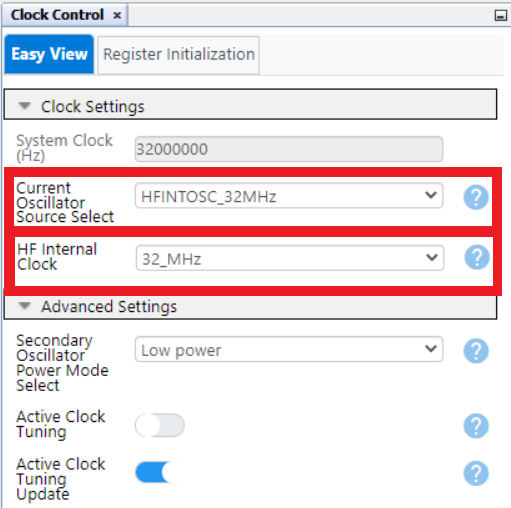
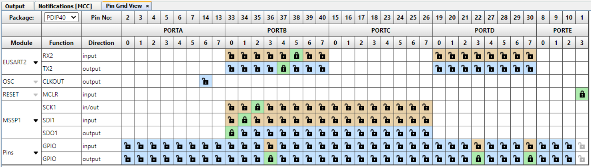
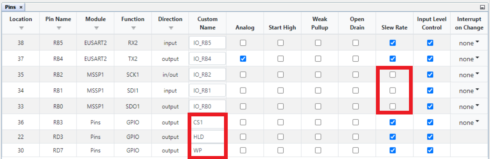
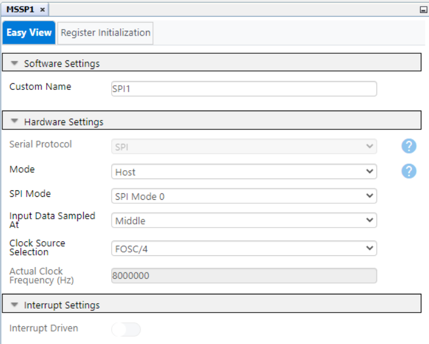
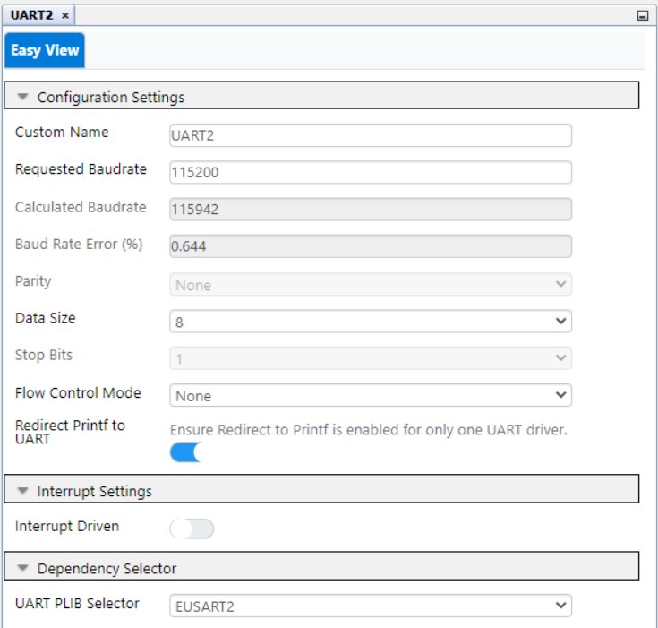
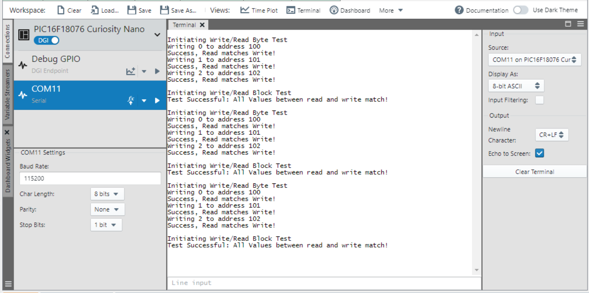

<!-- Please do not change this logo with link -->

[](https://www.microchip.com)

# How to Write and Read to an External EEPROM with a PIC16F18076

This example will walk the user through how to read and write both a single byte and array of memory from a PIC16F18076 microcontroller on a curiosity nano development board to an external 25CSM04 EEPROM device on a Mikroe EEPROM 7 click board using MPLAB Code Configurator and the MSSP SPI peripheral. MCC will also be used to setup the microcontroller's pins and basic configurations while the UART peripheral will be configured for debugging and outputing the result of the example's included test of the write and read process.

## Related Documentation

- [PIC16F18076 Product Page and Datasheet](https://www.microchip.com/en-us/product/PIC16F18076?utm_source=GitHub&utm_medium=TextLink&utm_campaign=MCU8_MMTCha_pic16f18076&utm_content=pic16f18076-eeprom-demo-mplab-mcc)


- [25CSM04 Product Page and Datasheet](https://www.microchip.com/en-us/product/25CSM04?utm_source=GitHub&utm_medium=TextLink&utm_campaign=MCU8_MMTCha_pic16f18076&utm_content=pic16f18076-eeprom-demo-mplab-mcc)

## Software Used

- MPLAB® X IDE 6.0.5 or newer [(MPLAB® X IDE 6.0)](https://www.microchip.com/en-us/development-tools-tools-and-software/mplab-x-ide?utm_source=GitHub&utm_medium=TextLink&utm_campaign=MCU8_MMTCha_MPAE_Examples&utm_content=pic16f18076-read-write-external-memory-github)
- MPLAB® XC8 2.40.0 or newer compiler [(MPLAB® XC8 2.40)](https://www.microchip.com/en-us/development-tools-tools-and-software/mplab-xc-compilers?utm_source=GitHub&utm_medium=TextLink&utm_campaign=MCU8_MMTCha_MPAE_Examples&utm_content=pic16f18076-read-write-external-memory-github)
- MPLAB® Code Configurator (MCC) 5.2.2 or newer [(microchip.com/mplab/mplab-code-configurator)](https://www.microchip.com/en-us/tools-resources/configure/mplab-code-configurator?utm_source=GitHub&utm_medium=TextLink&utm_campaign=MCU8_MMTCha_pic16f18076&utm_content=pic16f18076-eeprom-demo-mplab-mcc)
- MPLAB® Code Configurator (MCC) Device Libraries PIC10 / PIC12 / PIC16 / PIC18 MCUs [(microchip.com/mplab/mplab-code-configurator)](https://www.microchip.com/en-us/tools-resources/configure/mplab-code-configurator?utm_source=GitHub&utm_medium=TextLink&utm_campaign=MCU8_MMTCha_pic16f18076&utm_content=pic16f18076-eeprom-demo-mplab-mcc)
- Microchip PIC16F1xxxx_DFP Series Device Support (1.15.191) or newer [(packs.download.microchip.com/)](https://packs.download.microchip.com/)

## Hardware Used

     - [PIC16F18076 Curiosity Nano (EV53Z50A)](https://www.microchip.com/en-us/development-tool/EV53Z50A?utm_source=GitHub&utm_medium=TextLink&utm_campaign=MCU8_MMTCha_pic16f18076&utm_content=pic16f18076-eeprom-demo-mplab-mcc)
     - [Curiosity Nano Base for Click boards™](https://www.microchip.com/en-us/development-tool/AC164162?utm_source=GitHub&utm_medium=TextLink&utm_campaign=MCU8_MMTCha_pic16f18076&utm_content=pic16f18076-eeprom-demo-mplab-mcc)
     - [EEPROM 7 Click board™](https://www.mikroe.com/eeprom-7-click)
     - Logic Analyzer such as Salae Logic 8™ or similar (Optional, but highly recommended for debugging)

## Setup

### Hardware Setup
The PIC16F18076 curiosity nano development board is connected to the curiosity nano base board with the Mikroe EEPROM 7 click board placed in mikro BUS 1.

### MPLAB Code Configurator Setup

### Configuration Bits

Set External Oscillator Selection bits to "Oscillator Not Enabled" and "Reset Oscillator Selection bits" to "HFINTOSC (32 MHz)".

### Clock Control

Set the "Current Oscillator Source Select" to "HFINTOSC_32MHz" and the "HF Internal Clock" to "32_MHz".

### Pins
Configure Pins to the table below:

Module | Function | Pin
--- | --- | ---
EUSART2 | RX2 | RB5
EUSART2 | TX2 | RB4
MSSP1 | SCK1 | RB2
MSSP1 | SDI1 | RB1
MSSP1 | SDO1 | RB0
Pins | GPIO (output) | RB3/RD3/RD7


In the "Pins" menu the user should rename pins RB3, RD3, and RD7 to "CS1", "HLD", and "WP" respectively for the function pin names to match the function of the corresponding pins. 

IMPORTANT NOTE: The user should also disable the Slew Rate for pins SPI Pins: SCK1, SDI1, SDO1 (RB2, RB1, RB0 respectively). Leaving the Slew Rate limit active on the MSSP SPI pins can cause issues with higher MSSP clock frequencies.

### SPI MSSP1

The MSSP SPI should be configured to "Host Mode" in "SPI Mode" should be set to "SPI Mode 0", with the input data sampled in the middle. The "Clock Source Selection" should be set to one of the "FOSC" setting, this example uses "FOSC/4" however "FOSC/16" and "FOSC/64" will work too.

### UART2

The user may set whatever baud rate they choose. A baud rate of 115200 will be used for this example.
Note: "Redirect Printf to UART" should be enabled for debugging and displaying test results for this demo, however is not necessary if the user only needs to write and read data to the external EEPROM.

### Application Code

Note: For simplicity and readability, the EEPROM OPCODES are defined as shown below and will be identified by their defined names throughout the code. Additionally all printf debug statements have been removed from the code snippets displayed here.

```C
#define WRITE_OPCODE        0x02
#define READ_OPCODE         0x03
#define WRDI_OPCODE         0x04 //Reset Write Enable
#define RDSR_OPCODE         0x05 //Read Status Register OPCODE
#define WRITE_ENABLE_OPCODE 0x06
#define WRBP_OPCODE         0x08 //Write Ready/Busy Poll
#define SRST_OPCODE         0x7C //Software device reset OPCODE
```

#### eepromWriteEnable()
```C
void eepromWriteEnable(void) 
{
    CS1_SetLow();
    SPI1_ByteExchange(WRITE_ENABLE_OPCODE);
    CS1_SetHigh();

    while(!(readStatusRegister() & 0x0002))
    {
        __delay_ms(1);
    }
    return;
}
```
Before any write can be initiated with the 25CSM04 EEPROM a Write Enable Opcode must be sent over the SDO line to the device. This function sends that opcode then uses the eepromReadStatusRegister() function to check the EEPROM's Status Register for a successful write enable. This function is automatically called in both write functions in this demo.

#### eepromReadStatusRegister()
```C
uint16_t readStatusRegister(void)
{
    uint16_t RDSR = 0x0000;
    CS1_SetLow();
    SPI1_ByteExchange(RDSR_OPCODE); //Send Read Status Register OPCODE
    RDSR = (uint16_t)SPI1_ByteExchange(0xff); //Read back incoming RDSR Byte 0
    RDSR |= ((uint16_t)SPI1_ByteExchange(0xff)) << 8; // Read back incoming RDSR Byte 1
    CS1_SetHigh();    
    return RDSR;
}
```
This function sends the RDSR_OPCODE through the MSSP and returns the status register. It's polled automatically in eepromWriteEnable() to check for a successful "Write Enable" operation and polled after every "Write" operation for the completion of that operation. This instruction may be bypassed in favor of a 5ms delay between write operations, however polling the Status Register will always be either quicker or equal to the 5ms delay.  

#### eepromWriteByte()
```C
void eepromWriteByte (uint24_t address, uint8_t data)
{
    eepromWriteEnable();
    uint8_t block[5];
    block[0] = WRITE_OPCODE;
    block[1] = address >> 16;
    block[2] = address >> 8;
    block[3] = address;
    block[4] = data;
   
    CS1_SetLow();
    SPI1_BufferExchange(&block[0], 5);
    CS1_SetHigh();
    
    while((bool)(readStatusRegister() & 0x3))
    {
        __delay_ms(1);
    }       
    return; 
}
```


The eepromWriteByte() function takes the desired address and data from the user and writes that data to that address. This function starts by internally calling eepromWriteEnable() at the beginning. Then it fills an array with the WRITE_OPCODE, the EEPROM address, and finally the desired byte of data. The SPI1_BufferExchange() is then used to transfer the data, and lastly readStatusRegister is used to check for the write command's completion.

#### eepromWriteBlock()
```C
void eepromWriteBlock (uint24_t address, uint8_t *block,int blockSize)
{
    if(blockSize > 256) 
    {
        printf("Error max block size for write is 256 bytes.");
        return;
    }
    uint8_t addressBlock[4];
    addressBlock[0] = WRITE_OPCODE;
    addressBlock[1] = address >> 16;
    addressBlock[2] = address >> 8;
    addressBlock[3] = address;

    eepromWriteEnable();
    CS1_SetLow();
    SPI1_BufferExchange(&addressBlock[0], 4);
    SPI1_BufferExchange(&block[0], blockSize);
    CS1_SetHigh();
    
    while((bool)(readStatusRegister() & 0x3))
    {
        __delay_ms(1);
    }     
    return; 
}
```
 The eepromWriteBlock() function follows the same principle as eepromWriteByte(), however it writes multiple bytes. The user should be aware this EEPROM segments its memory into 256-byte pages, and a block of data larger than a page will not be written properly. When a block write command reaches the end of a page the address will wrap around to the beginning of a page, so any data written past 256 bytes in a single block write will overwrite the data written at the beginning of that write. If the user desires to send more than 256-bytes at once they should split the data into smaller blocks and use multiple write commands. 

#### eepromReadByte()
```C
uint8_t eepromReadByte (uint24_t address)
{        
    uint8_t data;
    uint8_t _address[4];
    _address[0] = READ_OPCODE;
    _address[1] = (uint8_t)(address >> 16);
    _address[2] = (uint8_t)(address >> 8);
    _address[3] = (uint8_t)(address);
    
    CS1_SetLow();
    SPI1_BufferExchange(&_address[0], 4); //Send Read opcode and address
    data = SPI1_ByteExchange(0xff); //Receive Byte
    CS1_SetHigh();
    
    return data;
}
```
The eepromReadByte() function fills an array with the READ_OPCODE and specified address then uses SPI1_BufferExchange() to read the data located at the specified address on the external EEPROM.

#### eepromReadBlock()
```C
void eepromReadBlock(uint24_t startingAddress, uint8_t *block, int blockSize)
{
    uint8_t _address[4];
    _address[0] = READ_OPCODE;
    _address[1] = (uint8_t)(startingAddress >> 16);
    _address[2] = (uint8_t)(startingAddress >> 8);
    _address[3] = (uint8_t)(startingAddress);
    
    CS1_SetLow();
    SPI1_BufferExchange(&_address[0], 4); //Send Read opcode and address
    SPI1_BufferExchange(&block[0], blockSize);
    CS1_SetHigh();
    return;
}
```
The eepromReadBlock() function functions just like eepromReadByte(), however reads a specified number of bytes and then stores the returned values at the address for variable "block". Unlike eepromWriteBlock(), a single block read command can continue past the end of a page and read the entire EEPROM if desired. The function will start at the address specified by "startingAddress" and increment upwards with each subsequent clock cycle.

#### writeReadByteTest()
```C
void writeReadByteTest(uint24_t startingAddress)
{
    printf("\nInitiating Write/Read Byte Test\r\n");
    
    uint24_t address;
    uint8_t readValue;
    for(uint8_t i = 0; i < 3; i++)
        {
            address = startingAddress + (uint24_t)i;
            printf("Writing %x to address %x\r\n",i , address);
            eepromWriteByte(startingAddress + (uint24_t)i, i);
            readValue = eepromReadByte(address);
            if(i == readValue)
            {
                printf("Success, Read matches Write!\r\n");
            }
            else
            {
                printf("Error: Write was %u and Read was %u\r\n", i, readValue);
            }
        
        }
}
```
This function tests reading and writing three subsequent bytes using the eepromWriteyte() and eepromReadByte() functions and compares the data written and read. The result of the test is then printed.

#### writeReadBlockTest()
```C
void writeReadBlockTest(uint24_t startingAddress)
{
    printf("\nInitiating Write/Read Block Test\r\n");
 
    uint8_t writeData[10]; 
    uint8_t readData[10];
    uint8_t verifyWrite[10];
    
    for(int i = 9; i >= 0; i--)
    {
        writeData[i] = i;
        verifyWrite[i] = i;
    }
    
    #if DEBUG == 0b1
        printf("Writing Block\r\n");
        for(int i = 0; i < 10; i++)
        {
            printf("writeData[%u] = %u\r\n", i, writeData[i]);
        }
    #endif

    eepromWriteBlock(startingAddress, &writeData[0], 10);
        
    eepromReadBlock(startingAddress, &readData[0], 10);
        
    for(int i = 0; i < 10; i++)
    {
        if( verifyWrite[i] != readData[i])
        {
            printf("Error: Read Value does not match write value at index %u\r\n", i);
            printf("Write Value: %x != Read Value: %x\r\n", writeData[i], readData[i]);
            return;
        }
    }
        printf("Test Successful: All Values between read and write match!\r\n");
    return;   
}
```

This test uses eepromWriteBlock() and eepromReadBlock() to write and read a generated array. A saved copy of the written data is used for comparing with the read data.

Note: Due to eepromWriteBlock() wrapping around the EEPROM's memory pages and eepromReadBlock() continuing to the next page, the starting address of this test should be at the beginning of a page (any valid address  that ends with 0x00 should work, eg. 0x123400, 0x000100). Otherwise the address of the written data and read data will differ after the end of a page.

#### main()
```C
int main(void)
{
    SYSTEM_Initialize();
    SPI1_Open(0);
    HLD_SetHigh();
    WP_SetHigh();

    uint24_t startingAddress = 0x000100;
    int blockSize = 10;
    CS1_SetHigh();
    while(1)
    {
        writeReadByteTest(startingAddress);
        writeReadBlockTest(startingAddress);
        __delay_ms(5000);
    }    
}
```

Peripherals are initialized, the EEPROM's "Hold" and "Write Protect" pins are set high to disable them, and the test functions are called.

## Operation

The demonstration will automatically run on programming and output the results of it's own internal test out via UART and can be viewed in MPLAB Data Visualizer, or any terminal program configured for a baud rate of 115200. The user may include more detailed information about the exact details of the write and read process by including "#define DEBUG 0b1" in the main.c file.



## Summary

This example demonstrate basic read and write functionality using a PIC16F18076 microcontroler and an external 25CSM04 EEPROM device on a Mikroe EEPROM 7 click board.
